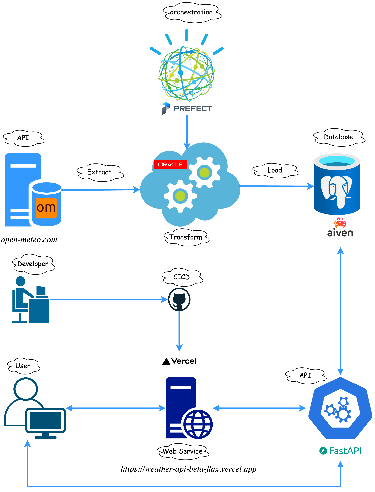

# City Weather API
🌍 Welcome to the City Weather API!

This API provides weather data for cities around the world allowing to retrieve essential daily weather details like temperature, humidity, wind speed, and more for any city. The data is prepared using hourly historical  weather information from [**ERA5**]("https://cds.climate.copernicus.eu/datasets/reanalysis-era5-single-levels?tab=overview") model provided by [Open-Meteo](https://open-meteo.com/").

## Overview
This diagram illustrates the architecture of a weather data API system, detailing the data flow from extraction to user access. Here’s a breakdown of the components and their roles:

1. **Data Extraction (Left Side)**  
   - The system fetches weather data from **Open-Meteo** (an open-source weather API).  
   - The data extraction process is indicated by the "Extract" label.

2. **Data Transformation and Storage (Center and Right Side)**  
   - Extracted data is processed in a cloud-based environment that includes **Oracle** for transformations.  
   - The transformed data is then loaded into a **PostgreSQL database** managed by **Aiven**.

3. **Workflow Orchestration (Top)**  
   - **Prefect** is used as an orchestration tool to manage the data pipeline, ensuring smooth extraction, transformation, and loading (ETL).

4. **CI/CD Pipeline and Deployment (Middle Left)**  
   - Developers push updates to a **GitHub** repository, triggering a CI/CD pipeline.  
   - **Vercel** is used for deployment, hosting the web service that exposes the API.

5. **User Interaction (Bottom Left and Right)**  
   - Users access the API through a **web service** deployed on Vercel (**https://weather-api-beta-flax.vercel.app**).  
   - The backend is built using **FastAPI**, which handles API requests and interacts with the database.

### Summary of Data Flow:  
1. **Extract:** Weather data is pulled from Open-Meteo.  
2. **Transform:** The data is processed using Oracle.  
3. **Load:** The processed data is stored in an Aiven-managed PostgreSQL database.  
4. **Orchestration:** Prefect manages workflow automation.  
5. **Deployment:** CI/CD via GitHub, deployment on Vercel.  
6. **API Interaction:** Users access the weather data via a FastAPI-based service hosted on Vercel.  

This setup ensures efficient weather data retrieval, transformation, and API-based access for users.

